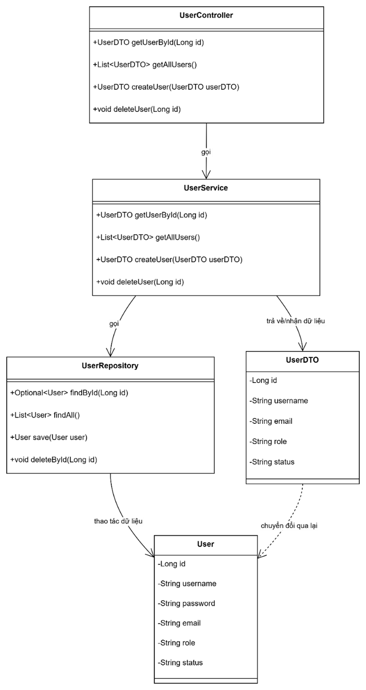

# 🎓 NPKSchool - Student Management System (Microservices Architecture)

## 📌 Overview
NPKSchool is a modern student management system designed for educational institutions, aiming to digitize the management of student information, academic performance, and reporting. The system is built using a microservices architecture for modularity, scalability, and maintainability.

This project was implemented using:
- **Backend**: Java Spring Boot
- **Frontend**: ReactJS
- **Database**: MySQL
- **Deployment**: Docker, GitHub Actions (CI/CD)

## 🧩 Key Features
- Role-based access: Admin, Teacher, and Student
- Manage student and teacher profiles
- Grade entry and academic progress tracking
- Class assignment and subject management
- Real-time statistics and performance reports
- Secure login and access control using JWT
- RESTful APIs via API Gateway
- CI/CD integration with GitHub Actions
- Dockerized microservices deployment

## 🛠 Technologies Used
- Java Spring Boot (for User, Student, Teacher services)
- Spring Security + JWT Authentication
- Spring Cloud Gateway for routing
- ReactJS frontend (SPA with routing)
- MySQL databases per service
- Docker Compose for local orchestration
- GitHub Actions for CI/CD pipeline

## ⚙️ System Architecture

### C4 Model Breakdown:
- **Level 1: System Context Diagram**
  - Shows interaction between Users (Admin, Teacher, Student) and the NPKSchool system
  
- **Level 2: Container Diagram**
  - ReactJS Frontend communicates with backend microservices via Spring Cloud Gateway
  
- **Level 3: Component Diagram**
  - Each service contains Controller, Service, Repository layers
  
- **Level 4: Module Diagram**
  - Modules separated by domain: student, teacher, authentication, etc.
  

## 🗂 Core Microservices
- `user-service`: Authentication, user roles, registration
- `student-service`: Manage student info, class assignment, grades
- `teacher-service`: Manage teacher info and teaching assignments
- `gateway-service`: Central API routing and security filter

## 📊 Example User Stories

### Admin
- Add/edit/delete student and teacher records
- Assign roles and access levels
- View overall academic performance reports

### Teacher
- View class list and student profiles
- Enter and update grades
- Track academic performance

### Student
- View personal academic record and grades

## 🚀 Deployment & CI/CD
- Microservices containerized with Docker
- `docker-compose.yml` orchestrates all services
- GitHub Actions handles CI (build/test) and CD (deploy)

## 🧠 Future Improvements
- Add parent portal integration
- Notification system for grade updates
- Expand to fee management, teacher performance, etc.
- Switch to Kubernetes for cloud-native scalability

